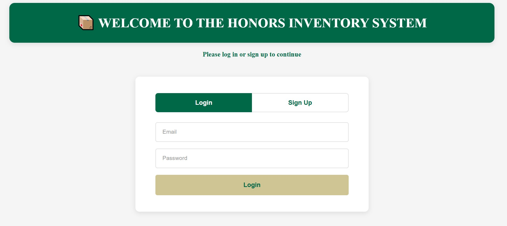
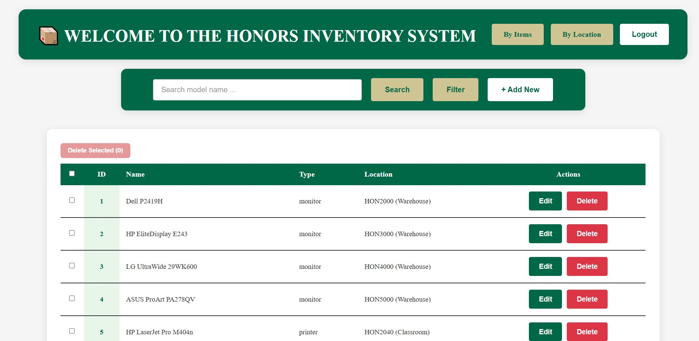
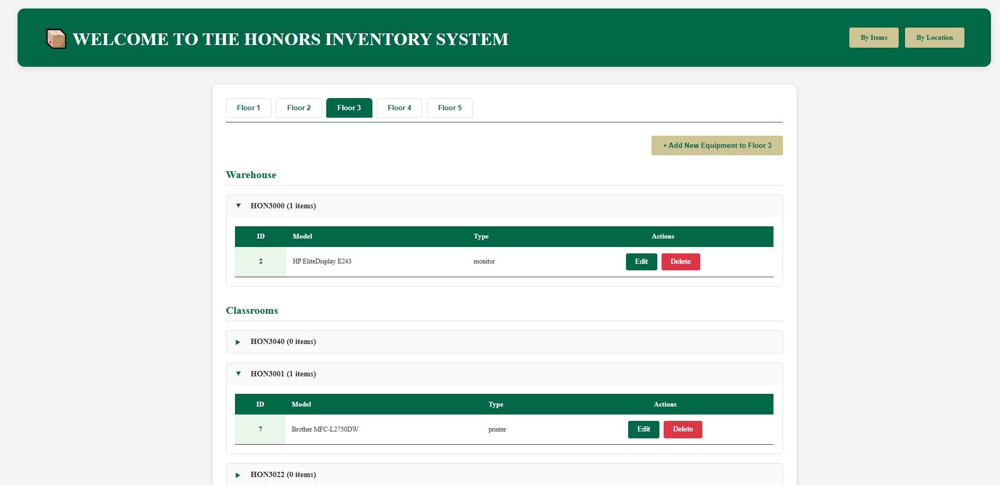
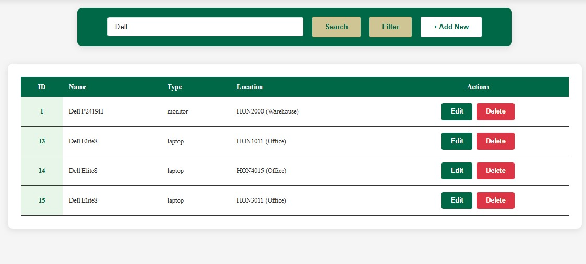
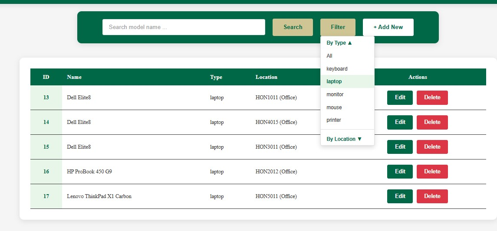
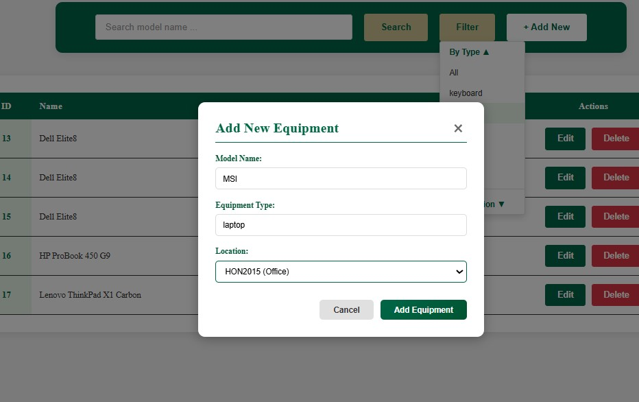
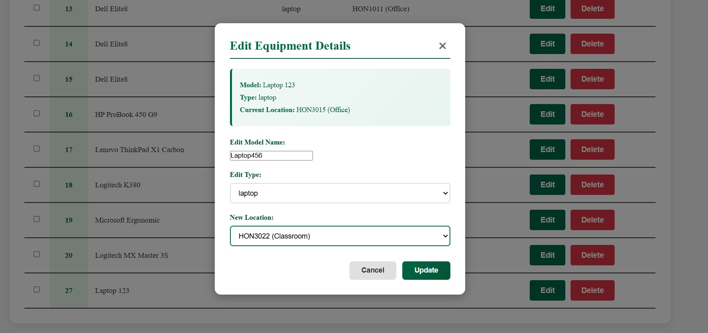

# 📦 Honors Inventory System

> **Note:** For the original submission, see the [`sqlite-original`](https://github.com/nnviet06/Honors-Inventory-System/tree/sqlite-original) branch.  

> This `main` branch rebuilds the backend using PostgreSQL for scalability.

A full-stack equipment inventory management system. This application allows staff to track, manage, and transfer IT equipment across different locations within the Honors building.
Built for the Honors IT Team ❤

## Live Demo
https://honors-inventory-system.vercel.app/

## Project Overview

This inventory system enables the Honors IT Team to:
- **TRACK** (monitors, laptops, printers, keyboards, mice)
- **MANAGE LOCATIONS** across 5 floors (Warehouses, Classrooms, Offices)
- **ADD NEW** to inventory
- **DELETE** broken equipment
- **EDIT** equipment details
- **AUTHENTICATE** per-user login with data isolation
---
## Demo Screenshots

### Auth


### Items View


### Location View


### Search Function


### Filter Function


### Add New Equipment


### Edit Equipment


---

## Technology Stack

### Frontend: React + Vite + TypeScript + CSS Modules (deployed on Vercel)

### Backend: Node.js + Express + TypeScript (deployed on Render)

### Database: PostgreSQL (hosted on Supabase)

## Features

- **Authentication** - Email/password signup and login with per-user data isolation
- **"By Items" View** - Traditional table view of all equipment
- **"By Location" View** - Floor-by-floor navigation with collapsible sections
- **Add Equipment** - Modal form to add new items
- **Edit Equipment** - Edit model, type, and location of equipment
- **Delete Equipment** - Remove items from inventory
- **Search & Filter Button** - Search equipment by model name and filter by type and building location

## Installation (if you want to test it out by yourself)

### 1. Clone the Repository

```bash
git clone https://github.com/nnviet06/Honors-Inventory-System.git
cd Honors-Inventory-System
```

### 2. Install Backend Dependencies

```bash
cd backend
npm install
```

### 3. Install Frontend Dependencies

```bash
cd ../frontend
npm install
```

### 4. Setup Environment Variables

Create a `.env` file in the `backend/` directory:
```
SUPABASE_ANON_KEY=your_anon_key_here
SUPABASE_URL=your_project_url_here
PORT=5000
```

Create a `.env` file in the `frontend/` directory:
```
VITE_API_URL=http://localhost:5000
```

Get your credentials from [Supabase](https://supabase.com) → Project Settings → API

### 5. Setup Database

1. In Supabase dashboard, go to **SQL Editor**
2. Run the contents of `database/schema.sql`
3. Run the contents of `database/sample.sql` (locations only - equipment is auto-seeded per user on signup)
---

## How to Run

You need **TWO separate terminal windows** running simultaneously.

### Terminal 1: Start Backend Server

```bash
cd backend
npm run dev
```

### Terminal 2: Start Frontend Server

```bash
cd frontend
npm run dev
```
## Verification - How to Know It's Working

### After `npm install` (Backend):
**Expected output:**
- "added X packages, and audited X packages"
- "found 0 vulnerabilities" (or minimal low-severity warnings)
- No error messages in red

### After `npm run dev` (Backend):
**Expected output:**
```
[nodemon] starting `ts-node src/server.ts`
[dotenv@17.3.1] injecting env (4) from .env
Server running on http://localhost:5000
```
**Key indicators:**
- "injecting env (4) from .env"
- "Server running on http://localhost:5000"
- No error messages

### After `npm install` (Frontend):
**Expected output:**
- "added X packages, and audited X packages"
- "found 0 vulnerabilities" 
- No error messages in red

### After `npm run dev` (Frontend):
**Expected output:**
```
VITE v7.x.x ready in XXXms
➜  Local: http://localhost:5173/
➜  Network: use --host to expose
```
**Key indicators:**
- "ready in XXXms"
- Local URL displayed
- No error messages


### In Browser (http://localhost:5173):
**You should see:**
- Authentication page with Login/Sign Up tabs
- Sign up with email and password → redirects to equipment table with 20 sample items
- No "Failed to fetch" errors in console (F12)

**If everything above checks out → Your system is ready**

## Future planning
- Select All + Bulk Delete.
- Guest/Demo mode.
- Multiply the data size by many times.
- Implement Redis caching.

